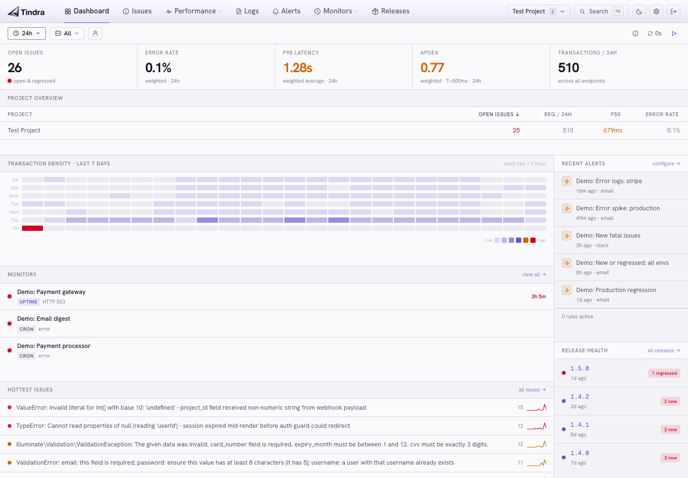

<p align="center">
  
</p>

<p align="center">Self-hosted error tracking, performance monitoring, uptime monitoring and cron monitoring.</p>

<p align="center">
  <a href="https://tindra.sh">tindra.sh</a> &nbsp;·&nbsp;
  <a href="https://tindra.sh/docs">Docs</a> &nbsp;·&nbsp;
  <a href="https://github.com/blendbyte/tindra/releases">Releases</a>
</p>

<p align="center">
  <a href="https://github.com/blendbyte/tindra/actions/workflows/ci.yml"></a>
  <a href="https://codecov.io/gh/blendbyte/tindra"></a>
  <a href="https://go.dev/dl/"></a>
  <a href="https://github.com/blendbyte/tindra/pkgs/container/tindra"></a>
  <a href="https://github.com/blendbyte/tindra/releases"></a>
  <a href="https://www.elastic.co/licensing/elastic-license"></a>
</p>

---

<p align="center">
  <picture>
    <source media="(prefers-color-scheme: dark)" srcset="dashboard-dark.png">
    
  </picture>
</p>

One Go binary. One Postgres database. Compatible with every Sentry SDK: point your DSN at Tindra and nothing else changes.

- **Dashboard** with KPI strip, transaction density heatmap, hottest issues, release health, and recent alerts
- **Error tracking** with grouping, stack traces, breadcrumbs, tags, assignees, merge and resolve
- **Performance monitoring** with transaction list, span waterfall, and p50/p75/p95/p99 percentiles
- **Cron monitors** with check-in history, missed/error alerts, and Sentry, Oh Dear, and Spatie SDK compatibility
- **Uptime monitors** with HTTP/HTTPS probing, configurable intervals and timeouts, expected status codes and body assertions, 24h/7d/30d uptime stats, and down/recovery alerts
- **Releases** linked to issues and regressions
- **Alerts** via email, Slack, Discord, Microsoft Teams, and webhooks, with filters, thresholds, and cooldowns
- **Source maps** resolved server-side, no client exposure
- **SSO** with Google, GitHub, Microsoft, Auth0, Zitadel, and any OIDC provider
- **Real-time** updates: new issues appear in the UI within a second of receipt
- **MCP server** built in - connect Claude or any MCP client via `POST /mcp` using an API token
- **Keyboard-first UI** with command palette, full dark mode, and virtualized lists at 60 fps

## Self-host

```bash
bash -c "$(curl -sSL https://install.tindra.sh)"
```

The installer creates a `docker-compose.yml` with a random database password, pulls the images, and sets up your first account. No manual SQL, no config files.

Full setup guide, environment variable reference, and backup docs at [tindra.sh/docs](https://tindra.sh/docs).

### Locked out by your authenticator

Clear the authenticator from the host, then log in with your password and re-enrol from Settings:

```bash
docker compose exec tindra /tindra users disable-mfa you@example.com
```

## License

[Elastic License 2.0](LICENSE)

## Maintained by Blendbyte

<br>

<p align="center">
  <a href="https://www.blendbyte.com">
    <picture>
      <source media="(prefers-color-scheme: dark)" srcset="https://www.blendbyte.com/logo_horizontal_light.png">
      
    </picture>
  </a>
</p>

<p align="center">
  <strong><a href="https://www.blendbyte.com">Blendbyte</a></strong> builds cloud infrastructure, web apps, and developer tools.<br>
  We've been shipping software to production for 20+ years.
</p>

<p align="center">
  This package runs in our own stack, which is why we keep it maintained.<br>
  Issues and PRs get read. Good ones get merged.
</p>

<br>

<p align="center">
  <a href="https://www.blendbyte.com">blendbyte.com</a> · <a href="mailto:hello@blendbyte.com">hello@blendbyte.com</a>
</p>
